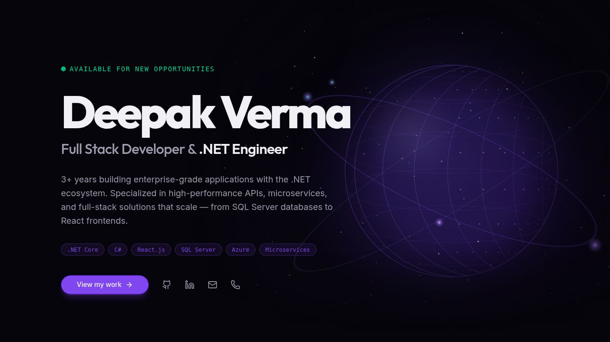

<div align="center">


<br/>

[](https://git.io/typing-svg)

<br/>

[](https://your-portfolio.vercel.app)
&nbsp;
[](https://www.linkedin.com/in/amikumardeepak/)
&nbsp;
[](https://github.com/imkumardeepak)
&nbsp;
[](mailto:amikumardeepak@gmail.com)
&nbsp;
[](tel:+918409671140)

<br/>


&nbsp;


</div>

---

## 🖥️ Portfolio Preview

<div align="center">



*Built with React 19 + TypeScript + Vite · Deployed on Vercel*

</div>

---

## 👨‍💻 About Me

```ts
const deepakVerma = {
  role        : "Full Stack Developer & .NET Engineer",
  company     : "Aarkay Techno Consultants",
  experience  : "4+ Years",
  location    : "India 🇮🇳",
  email       : "amikumardeepak@gmail.com",
  phone       : "+91 8409671140",

  highlights  : [
    "🚀 30% API performance improvement via query optimization & caching",
    "📦 1,000+ daily transactions handled in production systems",
    "🏗️  Architect of scalable ASP.NET Core microservices",
    "🎓 Mentor for junior developers — clean code evangelist",
    "💡 Available for new opportunities",
  ],

  currentlyLearning : ["Cloud-Native Architecture", "System Design", "DevOps"],
  funFact           : "I debug with logs and coffee ☕",
};
```

---

## 📊 GitHub Stats

<div align="center">


&nbsp;&nbsp;


<br/><br/>


<br/><br/>


</div>

---

## 🛠️ Tech Stack

<div align="center">

### ⚡ Backend & .NET


### 🎨 Frontend


### 🗄️ Databases


### ☁️ DevOps & Tools


</div>

---

## 💼 Work Experience

<table>
<tr>
<td width="50px" align="center">🏢</td>
<td>

### Full Stack Developer &nbsp;·&nbsp; Aarkay Techno Consultants


- 🚀 Designed and delivered enterprise apps handling **1,000+ daily business transactions**
- ⚡ Achieved **30% improvement in API response times** via query optimization and caching strategies
- 🏗️  Architected scalable **microservices** with ASP.NET Core; delivered React & Angular frontends
- 🎓 Mentored junior developers and led code reviews to maintain quality standards
- 🔄 Championed agile practices, clean architecture, and CI/CD pipeline automation

**Stack →** `ASP.NET Core` `React.js` `SQL Server` `Microservices` `Entity Framework Core` `Docker` `SignalR`

</td>
</tr>
<tr>
<td width="50px" align="center">🎓</td>
<td>

### .NET Developer Intern &nbsp;·&nbsp; Aarkay Techno Consultants


- 🔨 Built CRUD modules in **ASP.NET MVC** with database-driven features using Entity Framework
- 📊 Developed SQL Server stored procedures and optimized database queries
- 🧑‍💻 Onboarded to production-grade C# development under senior developer mentorship

**Stack →** `ASP.NET MVC` `C#` `SQL Server` `Entity Framework` `JavaScript` `Bootstrap`

</td>
</tr>
</table>

---

## 🚀 Featured Projects

<table>
<tr>
<td width="50%">

### 🥛 Milk Bakery Order Management


Comprehensive order management system for a milk & bakery business. Handles daily product orders, delivery scheduling, customer billing, and inventory tracking with optimized stored procedures for high-volume processing.

**Tech Stack**


</td>
<td width="50%">

### ⚖️ Weighbridge Management Application


Industrial weighbridge system recording vehicle weights, entry/exit logs, and weight-based billing. Integrates directly with physical scale hardware via serial communication protocol.

**Tech Stack**


</td>
</tr>
<tr>
<td width="50%">

### 🚛 Truck Management System


End-to-end fleet and logistics platform tracking trucks, trips, drivers, and fuel. Features **real-time status updates via SignalR**, route logging, maintenance scheduling, and analytics dashboards.

**Tech Stack**


</td>
<td width="50%">

### 📦 Asset Verification System


Digital audit platform replacing paper-based asset verification. Supports barcode & QR scanning, role-based approval workflows, and a complete immutable audit trail for compliance.

**Tech Stack**


</td>
</tr>
<tr>
<td colspan="2">

### 🖨️ Printer Integration Platform


Centralized print management platform unifying thermal, label, and document printers through a single API layer. Provides real-time device health monitoring, job queue management, and a web dashboard.

**Tech Stack**


</td>
</tr>
</table>

---

## 🌐 Portfolio — Built With

<div align="center">

| Technology | Role |
|:---:|:---:|
|  | UI Framework |
|  | Type Safety |
|  | Build Tool |
|  | Styling |
|  | Animations |
|  | Components |
|  | 3D Globe |
|  | Deployment |

</div>

### ⚡ Quick Start

```bash
# 1. Clone the repository
git clone https://github.com/imkumardeepak/portfolio.git

# 2. Install dependencies (from the portfolio subdirectory)
cd portfolio/artifacts/portfolio
npm install

# 3. Start the development server
npm run dev
# → http://localhost:3000
```

### 🚀 Deploy to Vercel

[](https://vercel.com/new/clone?repository-url=https://github.com/imkumardeepak/portfolio)

> The `vercel.json` at the repository root auto-configures the build — just connect and deploy.

---

## 📈 Contribution Activity

<div align="center">


</div>

---

## 📬 Get In Touch

<div align="center">

| Channel | Details |
|:---:|:---:|
| 📧 **Email** | [amikumardeepak@gmail.com](mailto:amikumardeepak@gmail.com) |
| 📱 **Phone** | [+91 8409671140](tel:+918409671140) |
| 💼 **LinkedIn** | [linkedin.com/in/amikumardeepak](https://www.linkedin.com/in/amikumardeepak/) |
| 🐙 **GitHub** | [github.com/imkumardeepak](https://github.com/imkumardeepak) |
| 🌐 **Portfolio** | [your-portfolio.vercel.app](https://your-portfolio.vercel.app) |

<br/>

> 💬 *I'm open to full-time roles, freelance projects, and exciting collaborations. Don't hesitate to reach out!*

</div>

---

<div align="center">


**Designed & Built by Deepak Verma** &nbsp;·&nbsp; © 2025 All Rights Reserved

*If you found this useful, consider giving it a ⭐*

</div>
